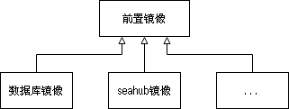

# 22.01.21

> 完成docker文档经验部分撰写；容器架构构思

## docker文档

将docker文档中的网络子部分完成。由此又开始重新思考docker中的问题。

最后一个关于维护的部分需要边测试边修改。

## 前置镜像

学习docker的大部分基本功能后，对docker有了更进一步认识，现在考虑对项目进行应用。其中首先要制作的就是所有组件容器的父镜像——前置镜像。

- 前置镜像制作过程

首先为了节省资源，避免重复下载较为耗时的前置资源，可以独立出来一个镜像`pansdu-preq`。

制作过程十分简单，通过`ubuntu:18.04`镜像生成容器，然后在容器上安装前置即可。最后commit镜像，然后save。

通过load测试，检验镜像已制作完成。

## 更正

制作前置镜像过程中发现了部署文档[deploy/2021](../../../man/deploy/2021.md)中的部分不精确失误，例如python-pip和python3-pip的问题、时区选择的问题，可能会造成读者怀疑。随后作出修正。

## 问题

最大的问题就是网络地址表示。撰写文档时发现ping和telnet使用主机名可以动态找到容器，但是其他提供地址的方式不能使用主机名。仅仅使用LAN ip显然会使维护成本提高。

目前一个思路是将地址变量化（借助hosts），以及通过脚本使其自动化。