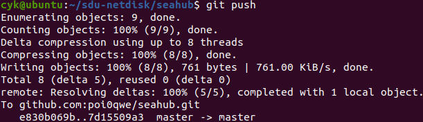

# 团队项目Git使用手册

> 本文章最后修改于2022-01-12。如有不符，敬请更正。


1. ## fork团队远程仓库

    > 为什么要fork：[Github - About forks](https://docs.github.com/en/pull-requests/collaborating-with-pull-requests/working-with-forks/about-forks)

    进入团队远程仓库，如[panSdu2/seahub](https://github.com/panSdu2/seahub)，点击右侧`fork`按钮。

    

    选择需要fork至的个人账户。等待forking。

    

    最终跳转至个人远程仓库，代表已经完成fork。

    

2. ## clone个人远程仓库到本地仓库

    > 本地需安装git：sudo apt-get install git

    点击github远程仓库的`code`按钮，可以展开查看远程仓库地址。
    
    
    
    如果使用Https协议，则每次pull和push都需要输入密码，十分麻烦。推荐使用SSH协议，手册默认使用SSH进行异地连接。

    - ### SSH配置

        如果你没有创建公钥，则会得到前文图中所示的黄色提示。回到控制台，创建密钥。输入如下命令：

        ```shell
        ssh-keygen
        ```

        接下来输入SSH密钥保存路径（默认为`~/.ssh/id_rsa`），然后两次输入密码（可为空），即可完成密钥的创建。

        

        接下来查看公钥

        ```shell
        cat ~/.ssh/id_rsa.pub
        ```

        随后复制全文，进入[Github - SSH New](https://github.com/settings/ssh/new)，粘贴公钥：

        

        点击`Add SSH Key`按钮，输入账户密码，成功创建SSH连接：

        

    复制图中的远程仓库链接。然后进入为本地仓库提前创建好的父目录，克隆远程仓库到本地仓库：

    ```
    git clone [SSH Link]
    ```

    

    这个时候会提示主机不符，输入yes即可继续。下载完成后，远程仓库被克隆到本地。


3. ## 配置本地上游仓库

    对于本项目，上游仓库就是团队远程仓库。克隆远程仓库到本地后，上游仓库尚未配置，需要我们手动配置。首先进入到本地仓库中，然后使用如下命令查看远程信息：

    ```shell
    git remote -v
    ```

    

    如果远程信息中只有origin信息，代表尚未配置上游信息，我们需要手动配置。

    复制团队远程仓库连接，然后使用如下命令：

    ```shell
    git remote add upstream [Organization SSH Link]
    ```

    

    再次查看远程信息，如果是如下所示，则配置成功：

    

4. ## 本地仓库管理

    在进行完成上述几步操作后，本地仓库与团队远程仓库处于隔离状态，正常的本地操作是完全不会影响到团队远程仓库的，因此可以对本地仓库进行随意修改。

    此时的各种区域如下所示：

    

    |区域|说明|
    |:-:|:-|
    |workspace 工作区|用户直接交互|
    |staging area 暂存区|更新的暂存区域|
    |local repository 本地仓库|本地维护的仓库|
    |remote repository 远程仓库|远程维护的仓库|

    - ### 将更新内容移交到暂存区

        在仓库根目录下执行：

        ```shell
        git add .
        ```

        可将所有自上次提交后更新的内容移交至暂存区。

        

        暂存区也是可以被任意修改的。你可以通过如下命令查看哪些差异内容已被移交至暂存区、哪些仍在工作区：

        ```shell
        git status -s
        ```

    - ### 将暂存区内容提交至本地仓库

        在仓库根目录下执行：

        ```shell
        git commit -m "[Comment]"
        ```

        可将暂存区内容提交到本地仓库。此时暂存区清空，本地仓库中创建了一个新的提交。

        

        提交后，所有更新都被应用到当前分支。如要回滚，见下文。

    - ### 分支管理（可选）

        设立多个分支的目的是本地仓库内的版本隔离（例如需要将发布版本和实验性版本隔离）。分支管理是非必要，可以跳过。

        - 创建分支

            ```shell
            git branch [Branch Name]
            ```

            可以创建一个新的分支。

            

        - 查看分支

            ```shell
            git branch
            ```

            可以查看分支，其中带有星号的是当前分支。

            

            （仓库默认存在的分支为主分支，即图中的master分支）

            <small>若展示多行信息，可以通过`Enter`或者`Down`键向后查看，并通过`q`键退出。</small>

        - 切换分支

            注意这是一个破坏性操作，分支的切换将会替换工作区中的内容，请确保切换前先进行一次add或commit。

            ```shell
            git checkout [Branch Name]
            ```

            

        - 合并分支

            你可以将两个分支进行合并（例如某些实验性内容得到确认后，将其加入到主分支）。和切换分支一样，需要注意工作区的内容已被提交。

            首先切换为被合并的分支，接下来使用如下命令进行合并：

            ```shell
            git merge [Branch Name]
            ```

            例如需要将dev合并到master，则切换为master，然后如图所示：

            

            输入这个命令后会跳转到文本编辑器去编辑该合并的说明：

            

            你可以对它进行修改，也可以直接保存并退出。（图中是Ubuntu的默认文本编辑器，`Ctrl+O`保存，`Ctrl+W`退出）

        - 合并冲突

            如果分支间发生了冲突，合并后会立刻告知哪里发生了冲突。需要手动解决冲突。

        - 删除分支

            在合并了分支后，或者分支对项目没有价值后，可以删除分支：

            ```shell
            git branch -d [Branch Name]
            ```

            

    - ### 标签（可选）

        标签是为了标识重大版本，作为里程碑而设定的。你可以很方便的通过标签找到某个提交。

        - 创建标签

            ```shell
            git tag [Tag Name]
            ```

            为当前分支的最后提交创建一个标签。
            
            ```shell
            git tag [Tag Name] [Commit ID]
            ```

            为某个提交创建一个标签。

        - 查看标签

            ```shell
            git tag
            ```

            查看所有标签。

        - 删除标签

            ```shell
            git tag -d [Tag Name]
            ```

            删除一个标签。

    - ### 回滚（可选）

        - 查看提交记录，获取提交id

            通过如下命令，简要查看提交记录：

            ```shell
            git log --oneline --decorate
            ```

            `--oneline`表示显示简要信息，`--decorate`是对文本进行修饰以便于阅读。提交记录中标为黄色的部分是提交id。

            对于分支关系复杂的项目，你可以加上`--graph`查看提交图：

            ```shell
            git log --oneline --decorate --graph
            ```

            

            <small>若展示多行信息，可以通过`Enter`或者`Down`键向后查看，并通过`q`键退出。</small>

        - 查看标签，获取提交id

            如下命令可以查看一个标签的详细信息：
            
            ```shell
            git show [Tag Name]
            ```

            其中的第一行包含了提交id：

            

        - 回滚

            使用如下命令，可以对版本进行回滚：

            ```shell
            git reset [--soft|--mixed|--hard] [Commid ID]
            ```

            |模式|回滚对象|效果|默认|
            |:-:|:-|:-|:-:|
            |`--soft`|仅HEAD指针|不破坏暂存区和工作区|否|
            |`--mixed`|HEAD指针与暂存区|不破坏工作区|是|
            |`--hard`|HEAD指针、暂存区、工作区|完全重置|否|

            硬重置具有破坏性，会丢失所有未提交的内容，需要谨慎使用；必要时可以在硬重置前先进行提交。

            `HEAD`可以用于指代当前提交，所以可以使用如下命令重置暂存区：

            ```shell
            git reset HEAD
            ```

5. ## push本地仓库到个人远程仓库

    如果你已经按照前面的操作配置好了仓库的远程信息，可以直接使用如下命令向个人远程仓库进行推送：

    ```shell
    git push
    ```

    

    来到github，你可以看到刚刚的提交记录

    

    （github上记录的提交时间，而非推送时间）

    注意，回滚后需要进行硬推送，以强制对远程仓库进行回滚：

    ```shell
    git push -f
    ```

    

6. ## pull个人远程仓库到团队远程仓库

    - 开发者

        本地仓库推送到远程后，只是将更新应用到了个人远程仓库中。你需要继续向团队仓库发送pull请求：

        

        点击`Open pull request`向团队仓库发起推送请求。

        

        再次确认仓库、分支等推送信息后，点击右侧`Create pull request`按钮。

        

        输入推送标题和推送文档，点击下方`Create pull request`按钮进行推送。

    - 管理员

        如果你是团队管理员，来到团队仓库，你可以看到有未解决的pull请求：

        

        若采纳该推送，则点击`Merge pull request`按钮。接下来将在团队仓库中应用个人仓库中的更新；若出现冲突，则会反馈冲突位置，此时需要手动解决。

        否则点击`Close pull request`驳回pull请求。

        

7. ## fetch团队远程仓库到本地仓库

    你需要使本地仓库和团队远程仓库保持同步，以应用来自团队其他成员的更新。一种较为麻烦的方法是通过个人远程仓库的`Fetch upstream`按钮应用上游仓库内容，然后再fetch到本地。第二种是直接将上游仓库fetch到本地，此处介绍后者。

    依次执行如下命令：

    ```shell
    git fetch upstream
    git checkout master
    git merge upstream/master
    ```

    上述三条指令的含义分别是拉取上游仓库、切换到主分支、将上游仓库主分支合并到本地仓库主分支。执行后本地仓库将应用团队远程仓库中更新的内容。

    注意切换分支可能造成工作区被破坏，所以建议先进行一次add或commit。